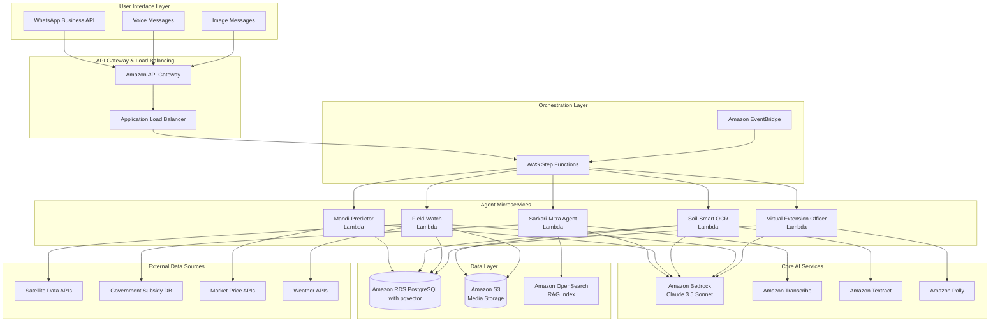
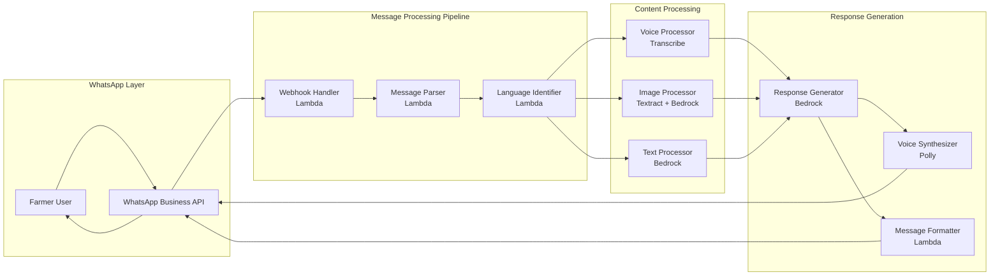
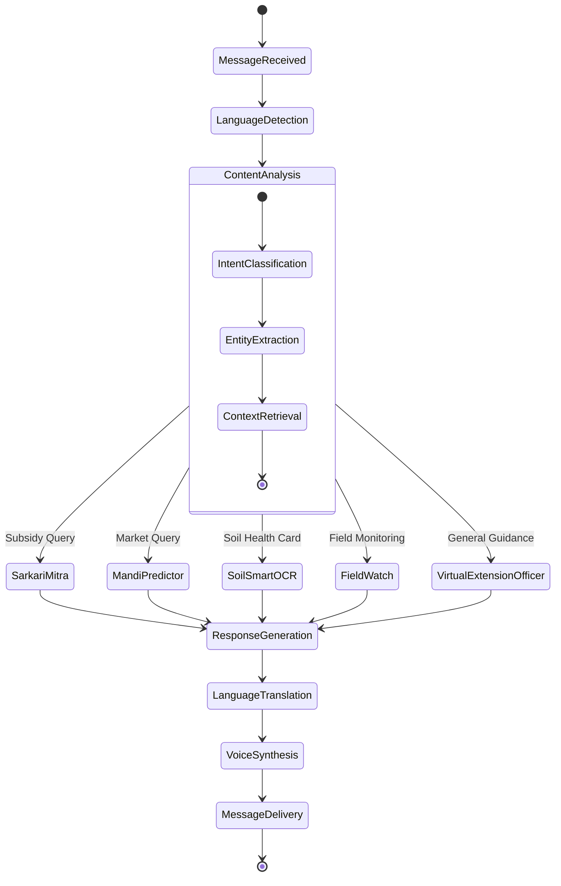
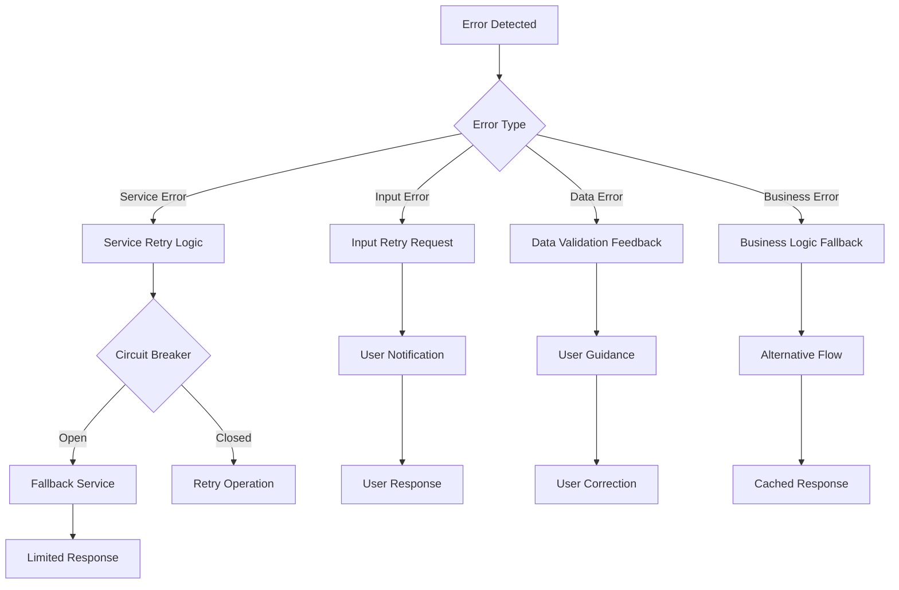

# Design Document: Kisan Setu AI

## Overview

Kisan Setu AI is a serverless, multilingual agentic operating system designed to serve rural farmers through WhatsApp as a Zero-UI interface. The system leverages AWS cloud services to provide intelligent agricultural assistance through four core agents: Sarkari-Mitra (government subsidies), Mandi-Predictor (market intelligence), Soil-Smart OCR (soil health management), and Field-Watch (satellite monitoring).

The architecture follows a microservices pattern using AWS Lambda functions orchestrated by Step Functions, with Amazon Bedrock (Claude 3.5 Sonnet) providing the core AI intelligence. The system supports 10 Indian languages and operates proactively as a Virtual Extension Officer.

## Architecture

### High-Level System Architecture



### WhatsApp Integration Architecture



### Agent Orchestration Flow



## Components and Interfaces

### 1. WhatsApp Interface Layer

**Webhook Handler Lambda**
- **Purpose**: Receives and validates WhatsApp webhook events
- **Input**: WhatsApp webhook payload (JSON)
- **Output**: Processed message object
- **Key Functions**:
  - Webhook signature verification
  - Message type identification (text, voice, image)
  - Rate limiting and spam detection
  - Event routing to appropriate processors

**Message Parser Lambda**
- **Purpose**: Extracts and normalizes message content
- **Input**: Raw WhatsApp message object
- **Output**: Structured message with metadata
- **Key Functions**:
  - Content extraction from different message types
  - Farmer profile lookup and context retrieval
  - Session management and conversation tracking

### 2. Language Processing Layer

**Language Identifier Lambda**
- **Purpose**: Detects and manages multilingual interactions
- **Input**: Text content or transcribed voice
- **Output**: Language code and confidence score
- **Supported Languages**: Hindi, Tamil, Telugu, Bengali, Marathi, Gujarati, Kannada, Malayalam, Punjabi, Odia
- **Integration**: Amazon Comprehend for language detection

**Voice Processor (Amazon Transcribe)**
- **Configuration**: Custom vocabulary for agricultural terms
- **Features**: Automatic language identification, speaker diarization
- **Accuracy Enhancement**: 20-50% improvement with agricultural domain vocabulary
- **Real-time Processing**: Streaming transcription for immediate response

### 3. Core Agent Services

**Sarkari-Mitra Agent Lambda**
- **Purpose**: Government subsidy matching using RAG
- **Architecture**:
  ```mermaid
  graph LR
      LR[Land Records] --> VE[Vector Embedding<br/>Cohere Multilingual]
      VE --> ES[OpenSearch<br/>Similarity Search]
      ES --> BR[Bedrock Claude 3.5<br/>Response Generation]
      GS[Government Subsidies<br/>Database] --> ES
      BR --> MR[Multilingual Response]
  ```
- **Key Functions**:
  - Land record analysis and farmer profiling
  - Subsidy eligibility matching with confidence scoring
  - Application guidance generation
  - Proactive notification scheduling

**Mandi-Predictor Lambda**
- **Purpose**: Market price forecasting and sell/store recommendations
- **Time-Series Models**: ARIMA, Prophet, and LSTM ensemble
- **Data Sources**: Historical mandi prices, weather data, crop calendars
- **Prediction Horizon**: 7-30 days with confidence intervals
- **Alert Triggers**: Price volatility thresholds and seasonal patterns

**Soil-Smart OCR Lambda**
- **Purpose**: Soil Health Card digitization and fertilization planning
- **OCR Pipeline**:
  ```mermaid
  graph LR
      IMG[Soil Health Card Image] --> TX[Amazon Textract<br/>Document Analysis]
      TX --> VL[Data Validation<br/>Lambda]
      VL --> FP[Fertilization Planner<br/>Bedrock]
      FP --> SP[7-Day Schedule<br/>Generation]
  ```
- **Validation Rules**: Nutrient value ranges, pH bounds, soil type consistency
- **Fertilization Algorithm**: NPK optimization based on crop type and growth stage

**Field-Watch Lambda**
- **Purpose**: Satellite-based field monitoring and alert generation
- **Data Sources**: Sentinel-2, Landsat-8, weather APIs
- **Monitoring Parameters**:
  - NDVI (Normalized Difference Vegetation Index)
  - Soil moisture levels
  - Temperature stress indicators
  - Pest risk modeling
- **Alert Frequency**: Every 6 hours with 30-minute response SLA

**Virtual Extension Officer Lambda**
- **Purpose**: Proactive agricultural guidance and coordination
- **Intelligence**: Seasonal farming calendars, weather-based recommendations
- **Proactive Triggers**:
  - Crop growth stage transitions
  - Weather pattern changes
  - Government scheme deadlines
  - Market opportunity alerts

### 4. Data Management Layer

**Amazon RDS PostgreSQL with pgvector**
- **Schema Design**:
  ```sql
  -- Farmer profiles with multilingual support
  farmers (
    id UUID PRIMARY KEY,
    phone_number VARCHAR(15) UNIQUE,
    preferred_language VARCHAR(10),
    land_records JSONB,
    location GEOGRAPHY(POINT),
    created_at TIMESTAMP
  );
  
  -- Vector embeddings for RAG
  subsidy_embeddings (
    id UUID PRIMARY KEY,
    subsidy_id VARCHAR(50),
    content_vector VECTOR(1536),
    language VARCHAR(10),
    metadata JSONB
  );
  
  -- Conversation history
  conversations (
    id UUID PRIMARY KEY,
    farmer_id UUID REFERENCES farmers(id),
    message_type VARCHAR(20),
    content TEXT,
    agent_response TEXT,
    language VARCHAR(10),
    timestamp TIMESTAMP
  );
  ```

**Amazon S3 Storage Structure**
```
kisan-setu-ai/
├── voice-messages/
│   ├── {farmer_id}/
│   │   └── {timestamp}-{message_id}.wav
├── soil-health-cards/
│   ├── original/
│   │   └── {farmer_id}-{timestamp}.jpg
│   └── processed/
│       └── {farmer_id}-{timestamp}-extracted.json
├── satellite-data/
│   ├── ndvi/
│   └── moisture/
└── model-artifacts/
    ├── price-prediction/
    └── pest-risk/
```

**Amazon OpenSearch for RAG**
- **Index Structure**: Multilingual subsidy documents with vector embeddings
- **Search Strategy**: Hybrid search combining keyword and semantic similarity
- **Performance**: Sub-100ms query response with 99.9% availability

### 5. External Integrations

**Satellite Data Integration**
- **Primary Source**: Sentinel Hub API for Sentinel-2 data
- **Backup Source**: NASA Landsat-8 via Google Earth Engine
- **Processing Pipeline**: Cloud-optimized GeoTIFF → Lambda → RDS
- **Update Frequency**: Daily for NDVI, twice-daily for weather

**Government Subsidy Database**
- **Data Source**: Bharat Vistaar 2026 program database
- **Update Mechanism**: Daily ETL pipeline via AWS Glue
- **Data Format**: Structured JSON with multilingual descriptions
- **Validation**: Schema validation and data quality checks

**Market Price APIs**
- **Primary Source**: eNAM (National Agriculture Market) API
- **Secondary Sources**: State mandi boards, commodity exchanges
- **Data Frequency**: Real-time during market hours, daily historical
- **Caching Strategy**: Redis cluster for sub-second price lookups

## Data Models

### Core Data Structures

**Farmer Profile**
```typescript
interface FarmerProfile {
  id: string;
  phoneNumber: string;
  preferredLanguage: SupportedLanguage;
  landRecords: LandRecord[];
  location: GeoPoint;
  crops: CropInfo[];
  subscriptions: AlertSubscription[];
  conversationHistory: ConversationEntry[];
  createdAt: Date;
  lastActiveAt: Date;
}

interface LandRecord {
  surveyNumber: string;
  area: number; // in acres
  soilType: SoilType;
  irrigationType: IrrigationType;
  ownershipType: OwnershipType;
  coordinates: GeoPolygon;
}
```

**Message Processing**
```typescript
interface WhatsAppMessage {
  messageId: string;
  farmerId: string;
  messageType: 'text' | 'voice' | 'image';
  content: string | Buffer;
  language: SupportedLanguage;
  timestamp: Date;
  metadata: MessageMetadata;
}

interface ProcessedMessage {
  originalMessage: WhatsAppMessage;
  intent: Intent;
  entities: ExtractedEntity[];
  context: ConversationContext;
  confidence: number;
}
```

**Agent Responses**
```typescript
interface AgentResponse {
  agentType: AgentType;
  responseText: string;
  language: SupportedLanguage;
  confidence: number;
  actionItems: ActionItem[];
  followUpScheduled?: Date;
  attachments?: Attachment[];
}

interface ActionItem {
  type: 'reminder' | 'alert' | 'application_deadline';
  scheduledFor: Date;
  description: string;
  priority: Priority;
}
```

**Subsidy Matching**
```typescript
interface SubsidyMatch {
  subsidyId: string;
  subsidyName: string;
  eligibilityScore: number; // 0-1
  requiredDocuments: Document[];
  applicationDeadline: Date;
  estimatedBenefit: number;
  applicationSteps: ApplicationStep[];
  language: SupportedLanguage;
}
```

**Market Prediction**
```typescript
interface MarketPrediction {
  cropType: CropType;
  currentPrice: number;
  predictedPrices: PriceForecast[];
  recommendation: 'SELL' | 'STORE';
  confidence: number;
  riskFactors: RiskFactor[];
  nearbyMandis: MandiInfo[];
}

interface PriceForecast {
  date: Date;
  predictedPrice: number;
  confidenceInterval: [number, number];
  factors: PriceInfluencingFactor[];
}
```

**Soil Health Analysis**
```typescript
interface SoilHealthData {
  farmerId: string;
  testDate: Date;
  nutrients: {
    nitrogen: number;
    phosphorus: number;
    potassium: number;
    organicCarbon: number;
    pH: number;
    electricalConductivity: number;
  };
  micronutrients: {
    zinc: number;
    iron: number;
    manganese: number;
    copper: number;
    boron: number;
  };
  soilType: SoilType;
  recommendations: FertilizerRecommendation[];
}

interface FertilizerRecommendation {
  day: number; // 1-7
  fertilizer: FertilizerType;
  quantity: number; // kg per acre
  applicationMethod: ApplicationMethod;
  timing: 'morning' | 'evening';
  weatherConditions: string[];
}
```

**Field Monitoring**
```typescript
interface FieldMonitoringData {
  farmerId: string;
  fieldId: string;
  timestamp: Date;
  satelliteData: {
    ndvi: number;
    moistureLevel: number;
    temperatureStress: number;
    cloudCover: number;
  };
  alerts: FieldAlert[];
  recommendations: FieldRecommendation[];
}

interface FieldAlert {
  alertType: 'MOISTURE_STRESS' | 'PEST_RISK' | 'DISEASE_RISK' | 'WEATHER_WARNING';
  severity: 'LOW' | 'MEDIUM' | 'HIGH' | 'CRITICAL';
  description: string;
  actionRequired: string;
  timeframe: string; // e.g., "within 24 hours"
}
```

## Correctness Properties

*A property is a characteristic or behavior that should hold true across all valid executions of a system—essentially, a formal statement about what the system should do. Properties serve as the bridge between human-readable specifications and machine-verifiable correctness guarantees.*

Before defining the correctness properties, I need to analyze the acceptance criteria from the requirements document to determine which ones are testable as properties.

### Core Correctness Properties

Based on the prework analysis and property reflection, the following properties ensure system correctness:

**Property 1: Multilingual Voice Processing Accuracy**
*For any* voice message in supported Indian languages (Hindi, Tamil, Telugu, Bengali, Marathi, Gujarati, Kannada, Malayalam, Punjabi, Odia), the system should transcribe it with accuracy above the defined threshold and process the intent to generate appropriate agricultural guidance.
**Validates: Requirements 1.1, 1.2**

**Property 2: Language Consistency Across Interactions**
*For any* farmer interaction, if the input is provided in a specific language, then all system responses, recommendations, and guidance should be generated in the same language throughout the conversation session.
**Validates: Requirements 1.3, 3.4, 7.2**

**Property 3: Conversation Context Preservation**
*For any* multi-turn conversation within a session, the system should maintain and utilize context from previous interactions to provide coherent and contextually relevant responses.
**Validates: Requirements 1.5**

**Property 4: Image Processing and Analysis Completeness**
*For any* valid agricultural image (soil health card, crop, field), the system should successfully process it using appropriate AI services and generate specific, actionable recommendations based on the visual analysis.
**Validates: Requirements 2.1, 2.2, 2.3**

**Property 5: Error Handling and Clarification Requests**
*For any* unclear input (poor audio quality, insufficient image quality, ambiguous language), the system should detect the issue and request clarification from the farmer in their preferred language with specific guidance on how to improve the input.
**Validates: Requirements 1.4, 2.4, 7.4**

**Property 6: Data Storage with Proper Identification**
*For any* processed data (images, voice messages, soil data, farmer profiles), the system should store it in the appropriate AWS service (S3, RDS) with correct farmer identification and enable efficient retrieval through similarity searches where applicable.
**Validates: Requirements 2.5, 5.5, 9.1, 9.2**

**Property 7: Subsidy Matching and Ranking Accuracy**
*For any* farmer profile with land records, the system should retrieve relevant subsidies from the database using RAG, rank them by relevance and potential benefit, and include complete information (eligibility criteria, deadlines, required documents).
**Validates: Requirements 3.1, 3.2, 3.3**

**Property 8: Market Prediction and Recommendation Logic**
*For any* crop type and quantity specification, the system should generate price forecasts using time-series analysis and provide appropriate "Sell" or "Store" recommendations based on market conditions, including confidence levels and risk factors.
**Validates: Requirements 4.1, 4.2, 4.3, 4.4**

**Property 9: Soil Health Analysis and Fertilization Planning**
*For any* soil health card image, the system should extract all nutrient data, validate it for completeness and accuracy, and generate a comprehensive 7-day fertilization plan considering crop type, growth stage, and weather conditions.
**Validates: Requirements 5.1, 5.2, 5.3, 5.4**

**Property 10: Proactive Alert Generation and Completeness**
*For any* detected threat condition (moisture stress, pest risk, seasonal activity due, weather pattern change), the system should generate timely alerts with complete information including severity levels, affected areas, recommended actions, and response timelines.
**Validates: Requirements 6.1, 6.2, 6.3, 6.4, 8.1, 8.2, 8.3, 8.4**

**Property 11: Proactive Notification Timing**
*For any* database update (new subsidies, market changes), the system should notify affected farmers within the specified time limits (24 hours for subsidies, 30 minutes for field alerts).
**Validates: Requirements 3.5, 4.5, 6.5**

**Property 12: Language Support and Detection**
*For any* input in the supported languages, the system should correctly detect the language, maintain language preferences in farmer profiles, and use region-specific agricultural terminology in translations.
**Validates: Requirements 7.1, 7.3, 7.5**

**Property 13: Data Retrieval Performance**
*For any* farmer data access request, the system should retrieve historical information within 2 seconds while maintaining data encryption at rest and in transit.
**Validates: Requirements 9.3, 9.4**

**Property 14: System Resilience and Availability**
*For any* service failure or increased load, the system should implement retry logic, graceful degradation, automatic scaling, and maintain 99.5% availability during peak farming seasons.
**Validates: Requirements 10.3, 10.4, 10.5**

**Property 15: Backup and Data Retention**
*For any* data storage operation, the system should maintain automated daily backups with 30-day retention to ensure data durability and recovery capabilities.
**Validates: Requirements 9.5**

## Error Handling

### Error Classification and Response Strategy

**1. Input Processing Errors**
- **Voice Quality Issues**: Request clearer audio with specific recording instructions
- **Image Quality Problems**: Guide farmers on proper lighting and camera positioning
- **Language Ambiguity**: Prompt for language preference selection
- **Unsupported Content**: Provide clear guidance on supported input types

**2. Service Integration Errors**
- **AWS Service Failures**: Implement exponential backoff retry with circuit breaker pattern
- **External API Timeouts**: Fallback to cached data with staleness indicators
- **Database Connection Issues**: Queue operations for retry with user notification

**3. Data Processing Errors**
- **OCR Extraction Failures**: Request manual data entry with guided forms
- **Incomplete Soil Data**: Highlight missing fields and request additional information
- **Invalid Land Records**: Provide validation error messages with correction guidance

**4. Business Logic Errors**
- **No Matching Subsidies**: Suggest profile completion or alternative programs
- **Insufficient Market Data**: Provide historical trends with uncertainty indicators
- **Pest Risk Model Failures**: Fall back to seasonal risk patterns

### Error Recovery Mechanisms



### Graceful Degradation Strategy

**Service Priority Levels:**
1. **Critical**: WhatsApp message handling, basic voice transcription
2. **High**: Core agent responses, emergency alerts
3. **Medium**: Proactive recommendations, historical data queries
4. **Low**: Analytics, reporting, non-urgent notifications

**Degradation Actions:**
- **Level 1**: Disable non-critical features, use cached responses
- **Level 2**: Reduce response complexity, extend timeout limits
- **Level 3**: Queue non-urgent operations, notify users of delays
- **Level 4**: Emergency mode with basic text responses only

## Testing Strategy

### Dual Testing Approach

The testing strategy employs both unit testing and property-based testing to ensure comprehensive coverage:

**Unit Testing Focus:**
- Specific examples of successful interactions in each supported language
- Edge cases for image processing (poor lighting, partial cards, damaged documents)
- Error conditions and boundary values (invalid coordinates, extreme weather data)
- Integration points between AWS services
- Authentication and authorization flows

**Property-Based Testing Focus:**
- Universal properties that hold across all valid inputs
- Comprehensive input coverage through randomization
- Language consistency across all supported languages
- Data integrity and round-trip properties
- Performance characteristics under varying loads

### Property-Based Testing Configuration

**Testing Framework**: fast-check for Node.js Lambda functions, Hypothesis for Python components
**Minimum Iterations**: 100 per property test to ensure statistical significance
**Test Data Generation**:
- Multilingual text generators for all 10 supported languages
- Synthetic agricultural image generation for various crop types
- Randomized farmer profiles with diverse land records
- Market data generators with realistic price patterns

**Property Test Examples:**

```typescript
// Property 1: Multilingual Voice Processing
test('Voice processing accuracy across languages', async () => {
  await fc.assert(fc.asyncProperty(
    fc.record({
      language: fc.constantFrom('hi', 'ta', 'te', 'bn', 'mr', 'gu', 'kn', 'ml', 'pa', 'or'),
      audioContent: fc.string({ minLength: 10 }),
      farmerId: fc.uuid()
    }),
    async ({ language, audioContent, farmerId }) => {
      const result = await processVoiceMessage(audioContent, language, farmerId);
      expect(result.transcriptionAccuracy).toBeGreaterThan(0.85);
      expect(result.responseLanguage).toBe(language);
      expect(result.agriculturalGuidance).toBeDefined();
    }
  ), { numRuns: 100 });
});

// Property 6: Data Storage with Proper Identification
test('Data storage with farmer identification', async () => {
  await fc.assert(fc.asyncProperty(
    fc.record({
      farmerId: fc.uuid(),
      dataType: fc.constantFrom('image', 'voice', 'soilData', 'profile'),
      content: fc.uint8Array({ minLength: 100 })
    }),
    async ({ farmerId, dataType, content }) => {
      const storageResult = await storeData(farmerId, dataType, content);
      expect(storageResult.success).toBe(true);
      expect(storageResult.farmerId).toBe(farmerId);
      
      const retrievedData = await retrieveData(storageResult.id);
      expect(retrievedData.farmerId).toBe(farmerId);
      expect(retrievedData.content).toEqual(content);
    }
  ), { numRuns: 100 });
});
```

**Test Tags Format:**
Each property test must include a comment referencing its design document property:
```typescript
// Feature: kisan-setu-ai, Property 1: Multilingual Voice Processing Accuracy
// Feature: kisan-setu-ai, Property 6: Data Storage with Proper Identification
```

### Integration Testing Strategy

**WhatsApp Integration Tests:**
- End-to-end message flow from webhook to response delivery
- Rate limiting and spam detection validation
- Message type handling (text, voice, image, document)

**AWS Service Integration Tests:**
- Bedrock model invocation with various prompt types
- Transcribe accuracy with agricultural vocabulary
- Textract extraction from various document formats
- S3 storage and retrieval with proper permissions

**Database Integration Tests:**
- PostgreSQL with pgvector similarity searches
- Data consistency across concurrent operations
- Backup and recovery procedures

### Performance Testing Requirements

**Load Testing Scenarios:**
- Peak farming season traffic (10,000 concurrent farmers)
- Bulk image processing during soil testing season
- Simultaneous voice message processing
- Database query performance under load

**Performance Benchmarks:**
- Voice transcription: < 5 seconds for 30-second audio
- Image processing: < 10 seconds for soil health cards
- Database queries: < 2 seconds for farmer data retrieval
- End-to-end response: < 15 seconds for complex queries

**Monitoring and Alerting:**
- CloudWatch metrics for all Lambda functions
- Custom metrics for agricultural domain accuracy
- Real-time alerts for service degradation
- Performance dashboards for operational visibility